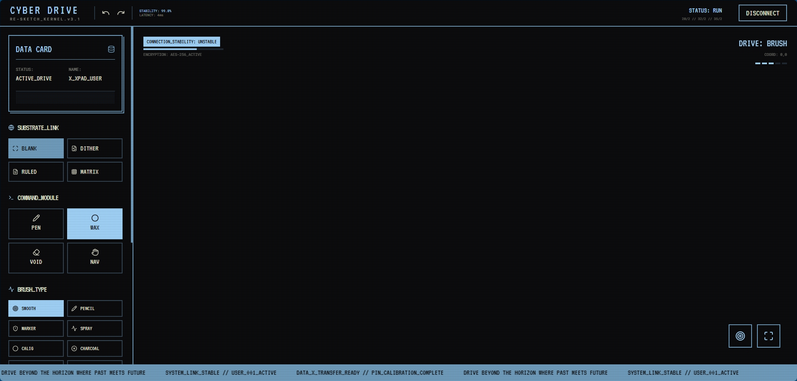

<div align="center">
  
</div>

<h1 align="center">X-Sketch Pro: Advanced Tablet Sketching</h1>

<div align="center">

[](LICENSE)
[](https://react.dev)
[](https://www.typescriptlang.org)
[](https://tailwindcss.com)
[](https://vitejs.dev)

</div>

<div align="center">
  <h3>
    <a href="#features">Features</a>
    <span> | </span>
    <a href="#brush-types">Brush Types</a>
    <span> | </span>
    <a href="#setup">Quick Start</a>
    <span> | </span>
    <a href="https://github.com/me-yeatz/X-Sketch">GitHub</a>
  </h3>
</div>

<h2 align="center">Professional-grade sketching application optimized for Android tablets</h2>

<p align="center">⚡ <strong>10 brush types</strong> • 🎯 <strong>Palm rejection</strong> • 🖼️ <strong>Layer support</strong> • 📱 <strong>Tablet optimized</strong><br/>
<strong>Cyberpunk aesthetics meet functional design</strong></p>

---

## Interface Showcase

<div align="center">
  
  <p><em>X-Sketch Pro running on desktop with cyberpunk UI and full brush engine</em></p>
</div>

---

## Why X-Sketch?

After using cluttered, over-designed sketching apps, we built X-Sketch to be different.

The problem with most drawing tools isn't missing features—it's **too few**. Every essential tool exists because it solves a real problem: **creating digital art**.

We believe the best tools are **expressive**. X-Sketch is built on the principle that **functionality drives creativity**—every feature exists to enhance your artistic expression.

**What makes it different:**
- **Cyberpunk interface** that combines retro aesthetics with modern functionality
- **10 brush types** from smooth ink to watercolor, oil, airbrush and more
- **Advanced palm rejection** optimized for Android tablets
- **Actually fast** because we care about performance
- **Open source** and free forever

---

## Features

**Drawing Tools**
- 10 different brush types with pressure sensitivity
- Pen, eraser, pan, and navigation tools
- Adjustable brush size and opacity
- Color palette with 10 preset options

**Canvas Options**
- Multiple background styles: plain, sketch, ruled notes, and dotted grid
- Import image backgrounds
- Pan and zoom functionality

**Export & Management**
- Export to PNG, JPG, SVG, and PDF formats
- Undo/redo functionality
- Layer management (coming soon)
- Workspace reset options

**Optimization**
- Palm rejection engine with adjustable sensitivity
- Pressure-sensitive drawing
- Low-latency ink rendering
- Tablet-optimized interface

---

## Brush Types

X-Sketch features 10 different brush types, each with unique characteristics:

- **Smooth** - Uses Quadratic Bezier curves for smooth ink
- **Pencil** - Textured, slightly rough edges
- **Marker** - Bold, slightly transparent, flat edges
- **Spray** - Particle-based spray paint effect
- **Calligraphy** - Variable width with angle sensitivity
- **Charcoal** - Soft, smudgy, textured edges
- **Watercolor** - Semi-transparent with color blending
- **Oil** - Thick texture with color blending
- **Ink Pen** - Consistent width with sharp edges
- **Airbrush** - Soft, gradient-like application with adjustable density

---

## Stack

<div align="center">

| Layer | Technology |
|-------|------------|
| Framework | React 19 |
| Language | TypeScript |
| Styling | Tailwind CSS |
| Icons | Lucide React |
| Drawing | Canvas API |
| Build | Vite |

</div>

---

## Setup

**Clone**
```bash
git clone https://github.com/me-yeatz/X-Sketch.git
cd X-Sketch
```

**Install**
```bash
npm install
```

**Run**
```bash
npm run dev
```

---

## Data Keys

```
localStorage        // for saving sketches (coming soon)
```

---

## Color System

<div align="center">

| Token | Hex | Usage |
|-------|-----|-------|
| `bg` | #0A0A0C | Background |
| `cyber-blue` | #72A0C1 | Primary accent |
| `cyber-cyan` | #A5D8FF | Secondary accent |
| `cyber-cream` | #E2E2D0 | Text |
| `dark` | #1A1A1A | Borders |

</div>

---

## Structure

```
├── App.tsx              // Main application
├── index.tsx            // Entry point
├── types.ts             // TypeScript definitions
├── components/
│   └── LandingPage.tsx  // Marketing page
├── services/
│   ├── BrushEngine.ts   // Brush rendering
│   └── PalmRejectionEngine.ts // Palm rejection
└── public/
    └── index.html       // HTML template
```

---

## Privacy

- Local storage only (coming soon)
- No external data collection
- Works offline
- Full data ownership
- No tracking

---

## License

MIT License - see [LICENSE](LICENSE) for details.

---

<p align="center">
  Built with purpose by <b>yeatz</b>
</p>

<p align="center">
  <sub>X-Sketch Pro // Ver. 2026.1 // Cyber Drive Sketching System</sub>
</p>
